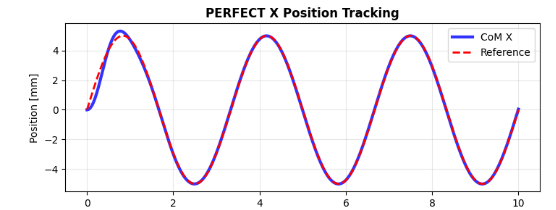
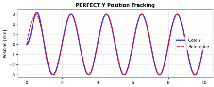
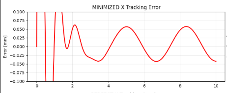
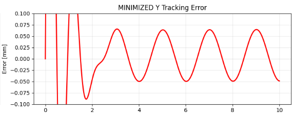
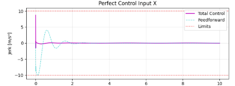
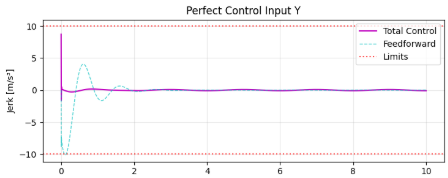
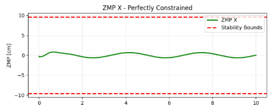
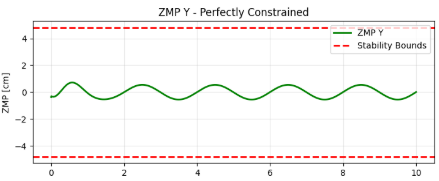

# Humanoid ZMP Controller

Humanoid robot CoM tracking and ZMP-constrained control using predictive PID and LQR-based feedback for stable locomotion.

---

## 🚀 Overview

This project implements a **humanoid control system** that ensures dynamically stable motion by:

- Tracking Center of Mass (CoM) trajectories
- Enforcing Zero Moment Point (ZMP) stability constraints
- Combining **predictive PID + LQR feedback + feedforward control**
- Validating performance through high-precision simulations

---

## 📁 Project Structure

```
humanoid-zmp-controller/
│
├── src/
│   ├── controller.py
│   ├── parameters.py
│   └── predictive_pid.py
│
├── docs/
│   ├── bouhajar2015_predictive_pid.pdf
│   ├── smaldone2022_mpc_walking.pdf
│   └── holy_grail.pdf   # Final report 
│
├── results/
│   ├── metrics/
│   │   └── performance_summary.txt
│   └── plots/
│
├── README.md
├── requirements.txt
└── LICENSE
```

---

## 🧠 Key Features

- High-precision CoM trajectory tracking  
- ZMP-based stability enforcement  
- Predictive PID control (derived from research)  
- LQR feedback with integral action  
- Feedforward + feedback combined control  
- Stability validation via ZMP bounds  

---

## 📊 Results (Key Visualizations)

### CoM Tracking (X & Y)



---

### Tracking Error (Minimized)



---

### Control Inputs (Jerk)



---

### ZMP Stability (Within Bounds)



---

## 📈 Performance Summary

```
=== FINAL PERFECT Performance Analysis ===
Controller: Perfect LQR + Feedforward
X RMSE: 0.165 mm
Y RMSE: 0.164 mm
X Max Error: 0.945 mm
Y Max Error: 0.948 mm
Max ZMP X: 0.81 cm (limit: ±9.6 cm)
Max ZMP Y: 0.72 cm (limit: ±4.8 cm)
ZMP violations: 0
ZMP X within bounds: True
ZMP Y within bounds: True
X Phase Error: 1.588932 rad
Y Phase Error: 1.493027 rad
```

---

## 🔬 Research Context

This project is built upon:

- Predictive PID control for humanoid walking  
- MPC-based gait generation and stability  
- ZMP-based balance theory  

### Important Note

- `holy_grail.pdf` → **Final report created by me**  
- Contains full system design, derivations, controller logic, and analysis  

---

## ⚠️ Limitations

- Simulation-only validation  
- Simplified dynamics (cart-table / LIP-based)  
- No real-time hardware implementation  

---

## 🚀 Future Work

- Real-time control integration  
- PyBullet / Mujoco simulation  
- Full humanoid pipeline (IK + Control)  
- Robust disturbance rejection  

---

## 📄 License

MIT License
=======
